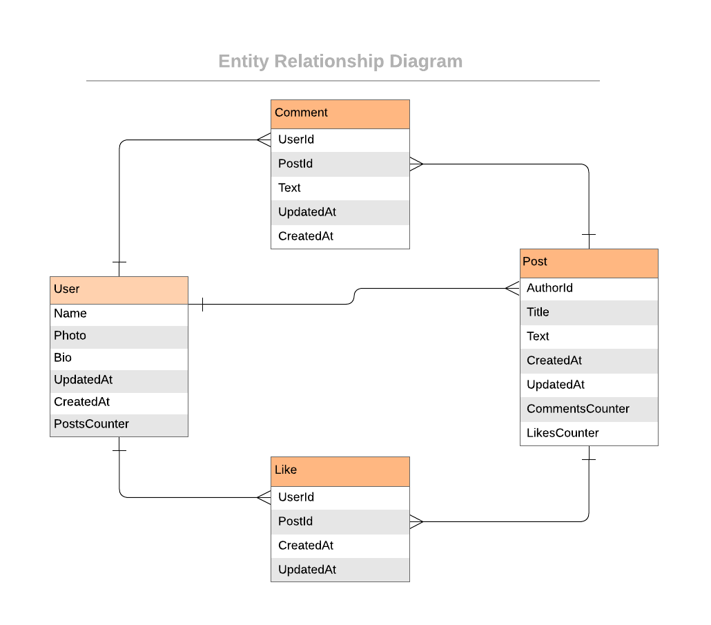

<a name="readme-top"></a>

<div align="center">
    <h1><b>Blog App</b></h1>
</div>

---

<!-- TABLE OF CONTENTS -->

# 📗 Table of Contents

- [📗 Table of Contents](#-table-of-contents)
- [📖 Blog App ](#-blog-app-)
  - [Learning objectives ](#learning-objectives-)
  - [🛠 Built With ](#-built-with-)
    - [Tech Stack ](#tech-stack-)
    - [Key Features ](#key-features-)
  - [💻 Getting Started ](#-getting-started-)
    - [Prerequisites](#prerequisites)
    - [Setup](#setup)
  - [👥 Authors ](#-authors-)
  - [🔭 Future Features ](#-future-features-)
  - [🤝 Contributing ](#-contributing-)
  - [⭐️ Show your support ](#️-show-your-support-)
  - [🙏 Acknowledgments ](#-acknowledgments-)
  - [📝 License ](#-license-)

---

<!-- PROJECT DESCRIPTION -->

# 📖 Blog App <a name="about-project"></a>

- The Blog App is a project that allows users to create, edit, and delete blog posts. Furthermore, the application let users interact with each other's posts by liking and commenting them. The project is built with Ruby on Rails and uses Postgres as a database.

- The project follows the data model shown bellow:

<p align="center">
  
</p>

### Learning objectives <a name="learning-objectives"></a>

- Install Ruby on Rails framework.
- Use Ruby Gems as a software packages system.
- Understand what ORM is.
- Use database migration files to maintain database schema.
- Set up associations between models.
- Use Active Record methods to query the database.
- Use validations for models.
- Write unit tests for models.

## 🛠 Built With <a name="built-with"></a>

### Tech Stack <a name="tech-stack"></a>

  <ul>
    <li>
      <a href="https://rubyonrails.org/">
        Ruby on Rails
      </a>
    </li>
  </ul>

---

<!-- Features -->

### Key Features <a name="key-features"></a>

- **[Set up with Postgres database]**
- **[Generation of migration files to maintain db schema]**
- **[Naming matches the provided ERD]**

<p align="right">(<a href="#readme-top">back to top</a>)</p>

<!-- GETTING STARTED -->

## 💻 Getting Started <a name="getting-started"></a>

To get a local copy up and running, follow these steps.

### Prerequisites

In order to run this project you need:

- You can follow the next guide to install Ruby on Rails:
  - [On Windows 11](https://gorails.com/setup/windows/11#linux-subsystem)
  - [On macOS](https://gorails.com/setup/macos/13-ventura)
  - [On Ubuntu](https://gorails.com/setup/ubuntu/22.04)

### Setup

Clone this repository to your desired folder:

Example commands:

- With SSH:

```bash
  cd my-folder
  git clone git@github.com:mwismann/blog_app.git
```

- With HTTPS:

```bash
  cd my-folder
  git clone hhttps://github.com/mwismann/blog_app.git
```

- With GitHub CLI:

```bash
  cd my-folder
  gh repo clone mwismann/blog_app.git
```

### Usage

- Run the following commands in your terminal:

```bash
  cd blog_app
  bundle install
  yarn install --check-files
  rails db:create
  rails db:migrate
  rails server
```

<p align="right">(<a href="#readme-top">back to top</a>)</p>

---

<!-- AUTHORS -->

## 👥 Authors <a name="authors"></a>

👤 **Mathias Wismann**

- GitHub: [@mwismann](https://github.com/mwismann)
- Twitter: [@mathias_wismann](https://twitter.com/mathias_wismann)
- LinkedIn: [Mathias Wismann](https://www.linkedin.com/in/mathias-wismann/)

<p align="right">(<a href="#readme-top">back to top</a>)</p>

---

<!-- FUTURE FEATURES -->

## 🔭 Future Features <a name="future-features"></a>

- [x] Create models for all entities in the ERD.
- [x] Use models to insert data.
- [x] Create custom method.
- [x] Add validations for models.
- [x] Write unit tests for models.

<p align="right">(<a href="#readme-top">back to top</a>)</p>

---

<!-- CONTRIBUTING -->

## 🤝 Contributing <a name="contributing"></a>

Contributions, issues, and feature requests are welcome!

Feel free to check the [issues page](https://github.com/mwismann/blog_app/issues).

<p align="right">(<a href="#readme-top">back to top</a>)</p>

---

<!-- SUPPORT -->

## ⭐️ Show your support <a name="support"></a>

Give a ⭐ if you liked this project!

<p align="right">(<a href="#readme-top">back to top</a>)</p>

---

<!-- ACKNOWLEDGEMENTS -->

## 🙏 Acknowledgments <a name="acknowledgements"></a>

I thank the Code Reviewers for their advice and time 🏆

<p align="right">(<a href="#readme-top">back to top</a>)</p>

---

<!-- LICENSE -->

## 📝 License <a name="license"></a>

This project is [MIT](./LICENSE) licensed.

<p align="right">(<a href="#readme-top">back to top</a>)</p>

---
